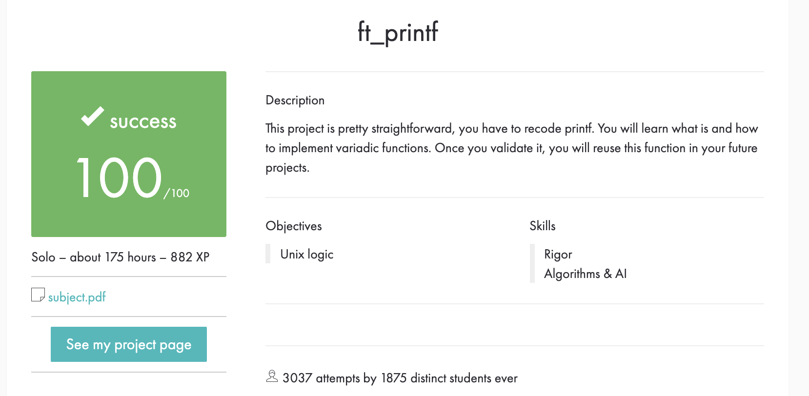

# Printf

<b>Description:</b>
Write a library that contains ft_printf, a function that will mimic the real printf. 

<i><a href="https://docs.google.com/document/d/1YVPX_ojm7pL4BQZHfIYDi-3z6dk-rsCfKNEp8Gog8wk/edit?usp=sharing">Julia's log for Printf</a></i>

<b>Sources for the Printf project:</b> 
<a href="https://docs.microsoft.com/en-us/cpp/c-runtime-library/format-specification-syntax-printf-and-wprintf-functions?view=msvc-160">Microsoft's documentation for Printf</a> 
<a href="https://www.cypress.com/file/54441/download">Article The Secret's of Printf</a> 
<a href="https://csnotes.medium.com/ft-printf-tutorial-42project-f09b6dc1cd0e">Printf Tutorial</a> 

<b>Testers:</b> 
Tripouille’s printf tester - https://github.com/Tripouille/printfTester (checks memory leaks, but not adapted to the new subject) 

